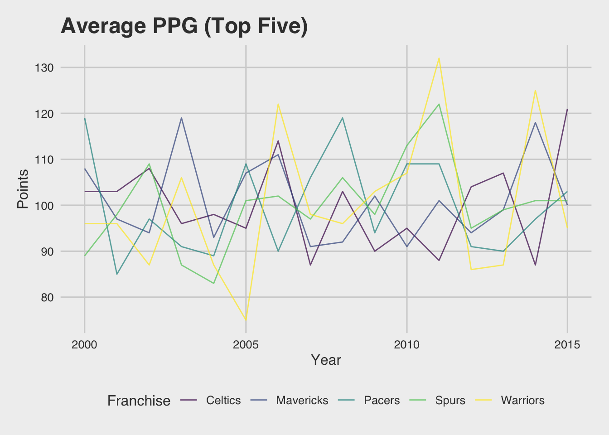
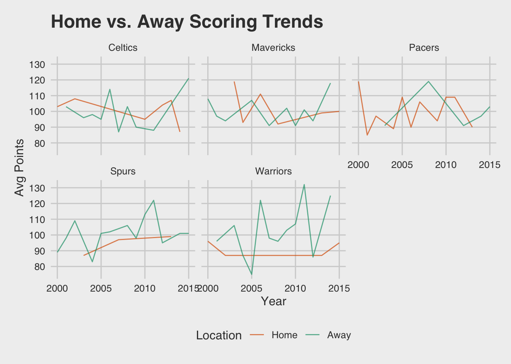
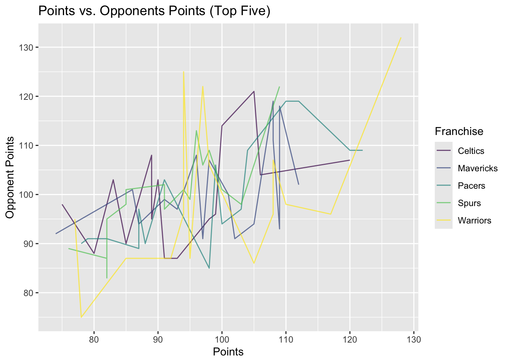

# NBA Team Performance and Elo Trend Analysis

## Overview
This is a project from a course for my statistics major at St. Lawrence University. This project analyzes NBA team performance using Elo ratings to evaluate team strength over a period of time. Elo ratings provide a dynamic measure of team quality by updating rankings after each game based on expected and actual outcomes. 

## Objective
The goal of this project is to:
- Analyze trends in team performance using Elo ratings
- Compare team strength across seasons
- Visualize how team rankings evolve over time

## Dataset
Source: [FiveThirtyEight NBA Elo Dataset](https://www.kaggle.com/datasets/fivethirtyeight/fivethirtyeight-nba-elo-dataset)

Covers historical NBA seasons 

Contains:
- Game-level data (teams, scores, dates)
- Pre and post-game Elo ratings
- Win Probabilities

## Tools and Technologies
- R
- ggplot2
- dplyr
- R Markdown

## Methodology 
- Teams with consistently high Elo ratings demonstrate sustained performance dominance
- Elo ratings capture momentum shifts throughout the season
- Upsets result in larger rating adjustments, reflecting unexpected outcomes
- Elo provides a more dynamic view of team strength compared to static metrics

## Visualizations
- Elo Rating Trends Over Time:
  
  
- Team Comparisons:
  
  
- Performance Distributions:
  

## How to Run
1. Load dataset
2. Run R Markdown file
3. Generate visualizations

## Future Improvements
- Incorporate player-level metrics
- Compare Elo with other rating systems
- Build predictive models for game outcomes
